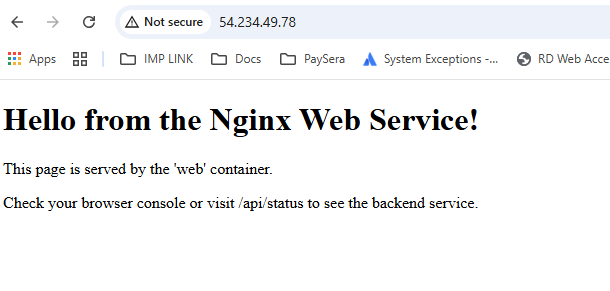

# 🐳 Docker Multi-Service Web Application

A demonstration of essential Docker and Docker Compose skills, orchestrating a simple three-tier web application stack featuring a web server, a custom API, and a Redis backend.

---

## 💡 Key Docker Skills Demonstrated

This project showcases the following practical Docker competencies:

* **Docker Compose:** Defining, networking, and orchestrating multiple interdependent services (`web`, `api`, `redis`) using a single `docker-compose.yml` file.
* **Multi-Stage Builds:** Utilizing an optimized `Dockerfile` for the custom `api` service to create a small, efficient production image by separating the build environment (installing Node.js dependencies) from the final runtime environment.
* **Internal Networking:** Services communicate securely using their service names as hostnames (e.g., the `api` container connects to the `redis` container using `redis:6379`).
* **Volume Mapping:** Defining a named volume (`redis_data`) to persist data for the Redis container, ensuring that the hit counter data survives container restarts.
* **Port Mapping:** Exposing specific service ports from the container to the host machine (e.g., mapping port **300** on the host to port 3000 inside the API container).

---

## ⚙️ Application Stack Overview

This application runs three containerized services:

| Service Name | Technology/Image | Exposed Host Port | Internal Container Port | Purpose |
| :--- | :--- | :--- | :--- | :--- |
| **web** | `nginx:latest` | `80` | `80` | Serves the static HTML frontend. |
| **api** | Custom Node.js (Express) | `300` | `3000` | Backend API. Handles requests and fetches/updates data from Redis. |
| **redis** | `redis:6.2-alpine` | None | `6379` | Fast, in-memory data store used to track the 'Total Hits' counter. |

---

## 📸 Project Verification Screenshots

The following screenshots confirm the application is running and the services are communicating correctly.

### 🌐 Frontend Web Service

This confirms the static content is served correctly via **port 80**.


### 💻 API and Redis Counter

This demonstrates the successful connection between the API (host port **300**) and Redis (internal network), with the counter incrementing on each refresh.


---

## 🚀 Setup and Running the Application

### Prerequisites

You must have **Docker Engine** and **Docker Compose** installed on your host machine.

### Instructions

1.  **Clone the Repository:**

    ```bash
    git clone [YOUR-GITHUB-REPO-LINK]
    cd docker-multi-service-app
    ```

2.  **Build and Start Services:**

    The `--build` flag ensures the custom Node.js image is built first. The `-d` flag runs the services in detached mode (in the background).

    ```bash
    docker compose up --build -d
    ```

3.  **Verify Functionality (using `localhost` or your EC2 Public IP):**

    * **Frontend (Web Service):** Check the static HTML page:
        `http://localhost/` or `http://[Your-IP]/`

    * **API & Redis (Counter Check):** Visit the API endpoint and **refresh the page** to verify that the `Total Hits` value increments:
        `http://localhost:300/api/status` or `http://[Your-IP]:300/api/status`

4.  **Stop and Clean Up:**

    To gracefully stop and remove all containers, networks, and volumes:

    ```bash
    docker compose down
    ```
